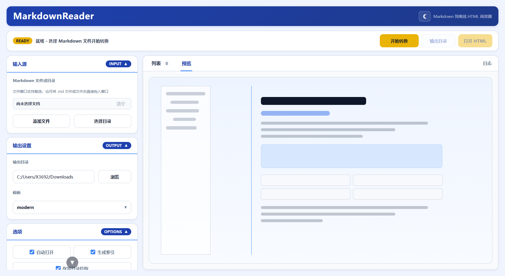
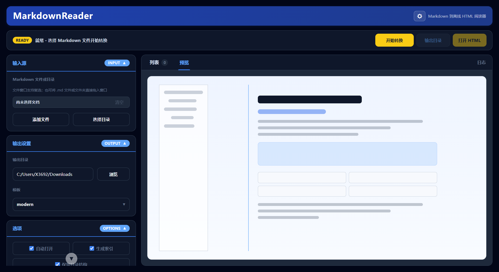
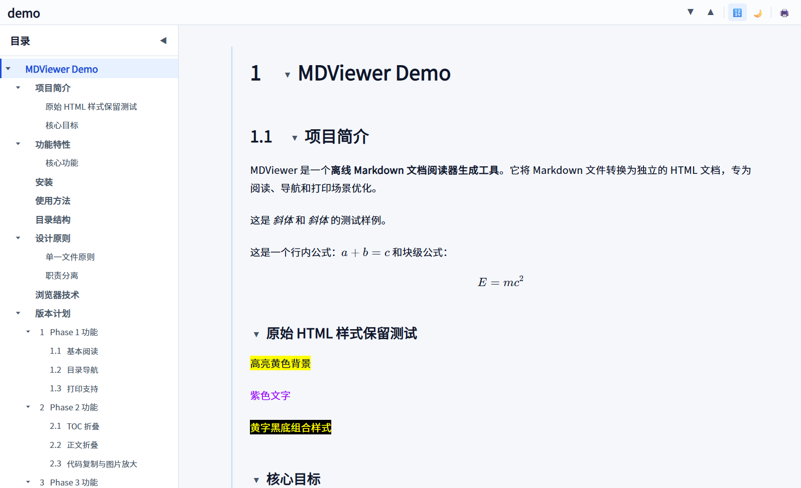
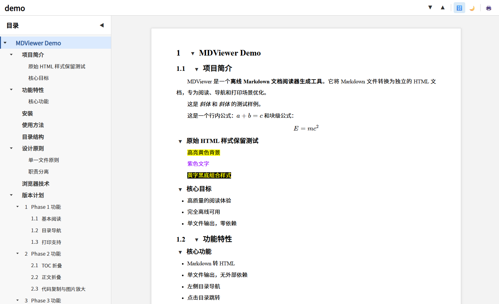
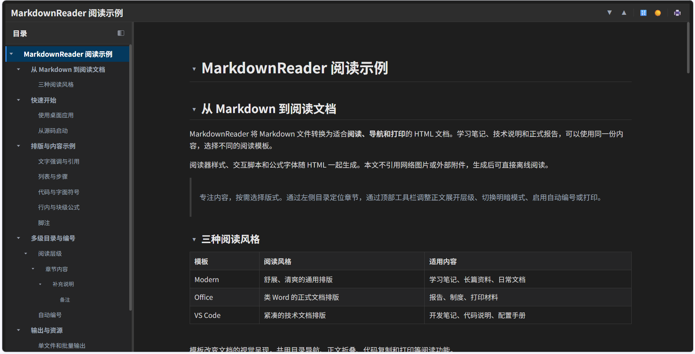

# MarkdownReader

MarkdownReader 是一款离线 Markdown 转 HTML 阅读器生成工具。

项目名称、应用窗口和构建产物统一使用 `MarkdownReader`；可执行文件为 `MarkdownReader.exe`，构建配置为 `packaging/MarkdownReader.spec`。 命名约定见 [项目命名说明](docs/NAMING.md)。

它将一个或多个 Markdown 文件转换为适合阅读、导航和打印的 HTML 文档。
生成结果内置阅读器 CSS、JavaScript、公式样式与公式字体（KaTeX），无需服务器或 CDN。
正文与界面字体只声明系统字体名，不内嵌字体文件。源 Markdown 中通过标准图片语法引用、
且本地可读取的图片会自动内嵌为 data URI，无需随 HTML 携带；网络图片与原始 HTML 中的
资源引用保持源文档行为，网络图片仍需要网络连接。

> 项目面向个人使用和内部发布。发布前仍需对本次构建完成回归与实机验证。

## 功能概览

- 单文件、Windows 原生多选与目录批量转换
- 资源管理器拖放、转换前清单与逐文件状态
- H1 至 H6 多级目录、跳转与滚动定位
- 正文和目录折叠
- 图片点击放大
- 代码复制
- 超宽表格与长代码横向滚动
- 行内公式与块级公式由本地 Node.js 预渲染
- Markdown 脚注和清单内跨文档链接重写
- 明暗主题、自动编号与打印优化
- 批量文档索引
- Modern、Office、VS Code 三种阅读模板

## 效果截图

### GUI（浅色模式）



左侧为输入源、输出设置和选项，右侧为“列表 / 预览 / 日志”页签；“预览”展示模板风格示意，不是当前 Markdown 的实时渲染。

<details>
<summary>查看 GUI 深色模式</summary>



两张 GUI 截图均选择 Modern 模板，右侧为模板风格示意；GUI 明暗模式与阅读模板的明暗模式分别控制。

</details>

### 阅读模板

三套模板均支持明暗切换；以下使用同一份 [阅读示例](samples/demo.md)，展示 Modern、Office 的浅色模式和 VS Code 的深色模式。

### Modern（浅色模式）



### Office（浅色模式）



### VS Code（深色模式）



## 普通用户

普通用户建议直接使用打包后的 `MarkdownReader.exe`。

基本流程：

1. 打开 `MarkdownReader.exe`。
2. 单选/复选 Markdown 文件，选择文件夹，或从资源管理器拖入文件和文件夹。
3. 选择输出目录。
4. 选择模板：`modern`、`office` 或 `vscode`。
5. 按“开始转换”。
6. 在“列表”查看逐文件状态；完成后点击“打开 HTML”阅读，或点击“输出目录”查看文件。启用“自动打开”时会自动打开阅读入口，批量生成索引时优先打开索引。

正式发布的 EXE 支持内置 Node.js。内置后，普通用户无需再安装 Python、Node.js 或 npm 依赖。

输入预检通过后，点击“开始转换”会将设置保存到 `MarkdownReader.exe` 同级目录的 `config.json`（源码运行时为项目根目录）。下次启动恢复设置；输入记录仅保存第一个输入来源的目录，不保存完整的多选文件清单。
- 仓库只提供 `config.example.json`；`config.json` 由程序在运行目录首次写入并已被 `.gitignore` 忽略，请不要把它提交进版本库。

## 开发者

源码运行需要本机安装：

- Python 3.11 或更高版本
- Node.js，且 `node` 命令可从 `PATH` 调用
- Microsoft Edge WebView2 Runtime

安装 Python 依赖：

```powershell
pip install -r requirements.txt
```

安装 Node 渲染依赖：

```powershell
cd node_renderer
npm install
cd ..
```

启动 GUI：

```powershell
python main.py
```

运行自动化测试：

```powershell
python -m pip install pytest
python -m pytest -q
```

## 输出规则

### 单文件转换

输入：

```text
notes/demo.md
```

输出：

```text
输出目录/demo.html
```

生成的 HTML 内置样式、脚本、目录和正文。通过标准图片语法引用、且本地可读取的图片会内嵌为 data URI，不再需要随 HTML 携带；网络图片与原始 HTML 中的资源引用保持原样。

### 多文件复选

点击“添加文件”后，可在 Windows 文件窗口中使用 `Ctrl` 或 `Shift` 复选多个
Markdown。也可以从资源管理器直接拖入文件或文件夹。所有实际参与转换的文档会先
显示在右侧“列表”页签中，可搜索文档并查看逐文件状态；重复文件自动去重，输出文件冲突会在写入前阻止转换。

### 文件夹批量转换

选择一个文件夹时，程序会递归收集其中的 `.md` 和 `.markdown` 文件（扩展名不区分大小写）。

未开启“保留目录结构”、且启用“生成索引”时输出：

```text
输出目录/
  文档A.html
  文档B.html
  索引-源文件夹名.html
```

开启“保留目录结构”后：

```text
输出目录/
  源文件夹名-HTML/
    第一章/
      文档A.html
    第二章/
      文档B.html
    索引-源文件夹名.html
```

索引页用于集中跳转到各个生成文档。文档链接默认在新标签页打开，看完后关闭标签页即可回到索引。取消“生成索引”后不生成索引页；多文件或混合来源批量转换的索引名为 `index.html`，单个文件直接转换不生成索引。

### 脚注与跨文档链接

源文档可以直接链接其他 Markdown：

```markdown
参见[第20章](./第20章.md#第二节)。

计量方法[^chapter]

[^chapter]: 参见[第20章](./第20章.md)。
```

当目标 Markdown 同样位于本次转换清单中时，链接会按照实际输出位置改写为 `.html`。
文档内 `#锚点`、网络链接和已经写成 `.html` 的旧链接保持不变。目标没有加入
转换清单时，程序保留原链接并在转换清单和日志中给出警告。

### 覆盖规则

当前生成时会写入目标 HTML 路径；如果目标文件已存在，会被新的生成结果覆盖。

## 模板

| 模板 | 定位 |
| --- | --- |
| `modern` | 清爽、舒适的通用阅读主题 |
| `office` | 类 Word 的正式文档与打印主题 |
| `vscode` | 类 VS Code Markdown Preview 的技术阅读主题 |
| `default` | 供其他模板继承的共享基础模板 |

`default` 提供共用的 `viewer.html`、`viewer.css`、工具栏、目录外壳和兼容变量。
个性化模板只覆盖必要的主题变量和视觉规则。

自定义模板可通过 `metadata.json` 继承基础模板：

```json
{
  "id": "mycompany",
  "name": "My Company",
  "version": "1.0.0",
  "description": "公司文档主题",
  "extends": "default"
}
```

在同一目录添加 `theme.css` 即可。不要复制 `viewer.js` 或另建阅读器。

## 打包

完成 Python 和 npm 依赖安装后，先安装打包工具：

```powershell
python -m pip install pyinstaller Pillow
```

在项目根目录构建单文件 Windows EXE：

```powershell
python -m PyInstaller --clean --noconfirm --workpath "packaging\.pyinstaller-build" --distpath "dist" packaging\MarkdownReader.spec
```

该命令会把 PyInstaller 的中间构建缓存放在 `packaging/.pyinstaller-build/`，最终产物输出到 `dist/MarkdownReader.exe`。这样可以避开默认 `build/` 目录可能出现的权限占用问题，同时仍然把缓存和输出保留在项目文件夹中，便于检查和清理。

发布前如需确保没有旧产物残留，可以先删除 `dist/`，再重新执行上面的打包命令。`packaging/.pyinstaller-build/` 是构建缓存，打包完成后可以安全删除。

发布给普通用户前，需要把 Windows 便携版 Node.js 放入：

```text
packaging/node/node.exe
```

打包后的 EXE 会优先使用内置 Node；如果未内置，则回退到系统 `PATH` 中的 `node`。本地构建已准备 `packaging/node/node.exe`；此文件被 Git 忽略，重新检出源码后需自行准备，不能仅凭打包成功认定已内置 Node。

详细说明见 [packaging/README.md](packaging/README.md)。

## 故障排查

### 提示找不到 Node.js

源码运行时，请确认已经安装 Node.js，并且 PowerShell 中可以执行：

```powershell
node -v
```

打包运行时，请确认打包前已放入：

```text
packaging/node/node.exe
```

### 公式没有渲染

公式由 Node 渲染器处理。请确认：

- `node_renderer/node_modules` 已安装。
- 源码运行时执行过 `cd node_renderer && npm install`。
- EXE 打包时已包含 `node_renderer/node_modules`。

### GUI 无法启动或空白

请确认系统安装了 Microsoft Edge WebView2 Runtime。Windows 10/11 通常已经内置或可通过 Edge 组件更新获得。

### 生成后浏览器没有自动打开

请检查 GUI 中“自动打开”是否启用。即使没有自动打开，生成的 HTML 仍会保存在输出目录。

### 打印效果和屏幕显示不完全一致

打印由浏览器打印引擎决定。Office 模板已针对 Edge 打印做过优化，但表格分页、边框和纸张缩放仍可能受浏览器和打印机驱动影响。

## 兼容范围

当前主要面向：

- Windows 10 / Windows 11
- Microsoft Edge / Chromium 内核浏览器
- Python 3.11+
- Node.js 18+ 或随 EXE 内置的 Windows 版 Node.js

生成的 HTML 阅读器主体可离线直接打开；本地 Markdown 图片已内嵌，无需保证图片可访问。
网络图片与原始 HTML 中的资源引用仍需源文档保证可访问。通常可在现代 Chromium 浏览器中直接打开。打印效果以 Microsoft Edge 为主要参考。

## 项目状态与限制

项目当前处于个人正式版候选、内部发布候选阶段。

当前已实现的功能：

- GUI 转换流程（文件/目录选择、拖入、预检清单、逐文件状态）
- 三套阅读模板（Modern / Office / VS Code）
- 阅读器交互：目录跳转、目录与正文折叠、滚动高亮、阅读位置恢复
- 图片、代码块、表格、公式渲染；代码复制、图片放大
- 批量索引与目录结构保留
- Windows 单文件 EXE 打包方案；正式构建可将 Python 运行时和便携版 Node.js 一并打包

最终发布前仍建议完成：

- 重新打包 EXE 并在干净目录试跑。
- 明确正式版本号和许可证策略。

已知限制：

- 暂未作为跨平台应用设计，主要测试环境是 Windows。
- Node 渲染器仍是必要组成部分；EXE 发布时应内置 Node.js，或要求用户本机安装 Node.js。
- 打印分页无法做到与 Microsoft Word 100% 一致。
- Markdown 原始 HTML 的复杂样式由浏览器自行解释，不保证所有网页级布局都适合打印。
- 已有 pytest 测试，覆盖转换清单、渲染链接、批量转换、demo 生成结构、转换边界契约和 GUI 结构约定；渲染测试需要 Node.js 和 npm 依赖，不能替代 GUI、打印和 EXE 实机验证。
- 本地 Markdown 图片会内嵌为 data URI，分享 HTML 时无需再携带图片文件；网络图片与原始 HTML 中的资源引用仍由源文档决定。
- 正文逐条折叠状态目前不会可靠持久化，刷新后可能按全局展开级别重新计算；
  滚动高亮会自动展开当前标题的目录父项，因此可能临时改变手动折叠的目录显示。
- 部分模板依赖系统安装的 `Source Han Sans SC`，对应字体文件未随 HTML 内嵌；
  未安装时由浏览器和系统字体回退决定实际显示。Modern / VS Code 当前还将该字体
  用作代码字体变量，因此代码显示不保证等宽。

## 项目结构

```text
core/                 Python 调度、配置、目录和文档生成层
gui/                  pywebview 桌面界面
node_renderer/        Node Markdown 渲染器
templates/default/    共享基础阅读器模板
templates/Modern/     Modern 阅读主题
templates/Office/     Office 正式文档主题
templates/Vscode/     VS Code 预览主题
templates/viewer.js   共用浏览器交互逻辑
templates/print.css   共用打印样式
packaging/            PyInstaller 配置与程序图标
docs/                 设计、架构、路线图和截图
tests/                转换清单、渲染链接、批量转换、demo 生成、转换边界、TOC 标题契约与 GUI 约定测试
samples/              Markdown 测试样例
```

## 许可证

当前项目暂不发布为开源项目，也暂未选择开源许可证。

在没有明确许可证文件之前，代码、文档、图标和截图默认保留全部权利，仅供作者本人学习、使用和继续开发。

